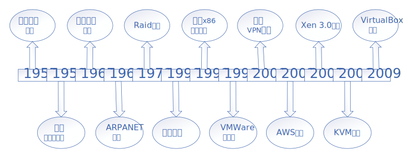

# 第1章 云原生架构
## 1.1 云计算的历史
* 云原生的历史
    
* 云服务提供商出租计算资源有3中模式：
    1. IaaS（Infrastructure as a service），即基础设施即服务。
    2. SaaS（Software-as-a-service）软件服务。开发、管理、部署都交给第三方，不需要关心技术问题，可以拿来即用。
    3. PaaS：平台服务，Platform-as-a-service是软件即服务（Software as a service，SaaS）的延伸。PaaS提供软件部署平台（runtime），抽象硬件和操作系统细节，可以无缝地扩展（scaling）。开发者只需要关注自己的业务逻辑，不需要关注底层。
    
* 虚拟化和容器的对比
    
## 1.2 云原生是什么
## 1.3 云原生的基础架构
### 1.3.1 微服务
* 单体应用与微服务
    
### 1.3.2 容器
### 1.3.3 服务网格
* Service Mesh与微服务
    